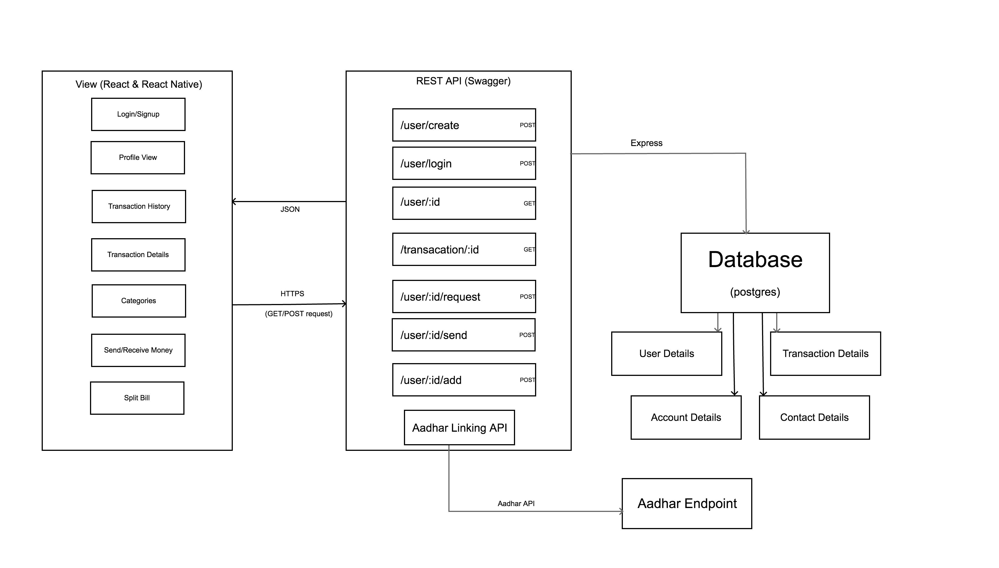
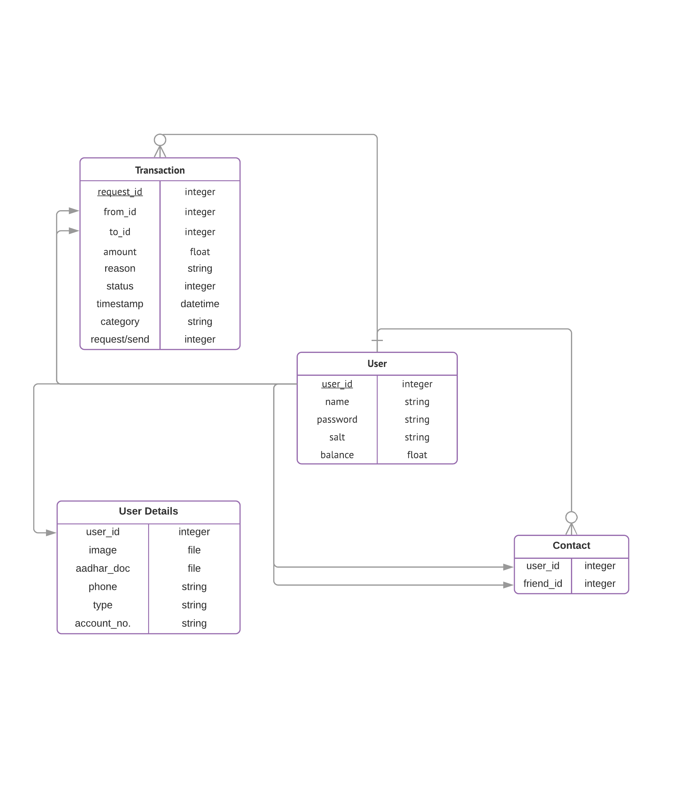

# Digital Bank Wallet( BATUA )

## **Objective**

Our main aim is to develop and MVP digital bank wallet that supports the following basic features:

- User Registration
- Transaction History (Payment/Request History)
- Split Bill facility for a group
- In-app notifications

- [Use Cases](#use-cases)
  - [Case 1(Registration)](#use-case-1)
  - [Case 2(Login)](#use-case-2)
  - [Case 3(Change password)](#use-case-3)
  - [Case 4(Add a contact)](#use-case-4)
  - [Case 5(Pay funds)](#use-case-5)
  - [Case 6(Request funds)](#use-case-6)
  - [Case 7(Notification)](#use-case-7)
  - [Case 8(Transaction history)](#use-case-8)
  - [Case 9(Create group)](#use-case-9)
  - [Case 10(Split bill)](#use-case-10)
- [Use Case Diagram](#use-case-diagram)
- [Block Diagram](#block-diagram)
- [ER Diagram](#er-diagram)

## **Use Cases**

### Use case 1

#### Register a new Customer

_Actors_ – Customer, Bank

_Description_ – This use case describes how to register a new customer using Aadhar card linking and using OTP sent to the linked mobile number with the user account.

- [Workflow](./docs/Workflows.md#use-case-1) –

### Use case 2

#### Login to an existing account

_Actors_ – Customer, Bank

_Description_ – This use case describes how to Login to an existing account

- [Workflow](./docs/Workflows.md#use-case-2) –

### Use case 3

#### Forget/Change password

_Actors_ – Customer, Bank

_Description_ – This use case describes how to change password (forgot password)

- [Workflow](./docs/Workflows.md#use-case-3)-

### Use case 4

#### Add contact

_Actors_ _–_ Customer, Bank

Description – This case describes how to add a friend or a contact to user&#39;s list.

- [Workflow](./docs/Workflows.md#use-case-4) –

### Use case 5

#### Pay funds to another user

_Actors –_ Customer, Bank

Description – This case describes how to pay money to a friend of the User&#39;s list.

- [Workflow](./docs/Workflows.md#use-case-5) –

#### Receive funds from another user

Description –This case describes how funds are received
- [Workflow](./docs/Workflows.md#use-case-6) –

### Use case 6

#### Request funds from another user.

**1.  Request funds from another user.**
  _Actors – Customer, Bank_

  Description –This case describes how to request money from another user.

- [Workflow](./docs/Workflows.md#use-case-6) –

**2. Another user requests funds from you**

* [Workflow](./docs/Workflows.md#use-case-6) –

### Use case 7
#### Get a notification for payment/request query

_Actors_ –Customer, Bank

Description – This case describes how user gets notification regarding payment/request.

- [Workflow](./docs/Workflows.md#use-case-7) – 

### Use case 8

####  View transaction history

## Use Case – View Transaction history

_Actors_ – Customer, Bank

Description – This case describes how user can see the transaction history.

- [Workflow](./docs/Workflows.md#use-case-8) – 

## Use Case Diagram

## Block Diagram

## ER Diagram

## Database Schema

